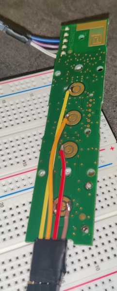
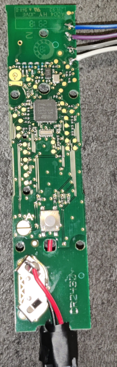
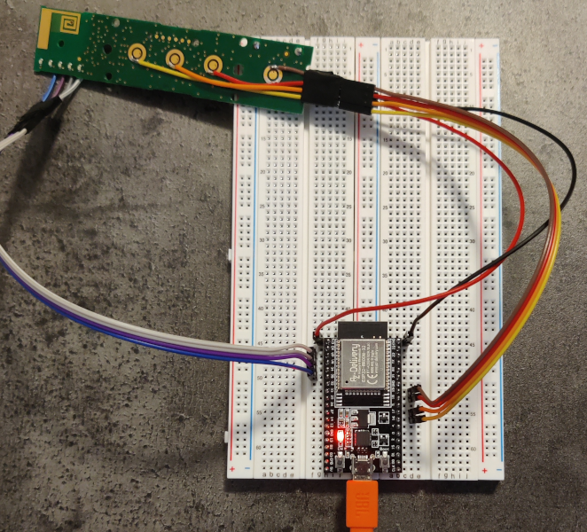
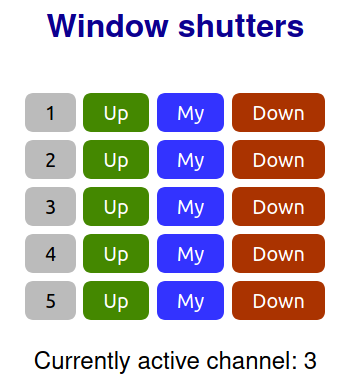

# Somfy IO remote control using Situo 5 io remote and ESP32
Control Somfy IO shutters using the PCB out of a Situo 5 io remote and an ESP32

## Why?
Contrary to the RTS models, there appears to be no open source implementation of the IO homecontrol protocol. Somfo's Connexoon and Tahoma home control boxes are expensive and the API is dependent on connectivity to the vendor's servers. I went for the workaround of controlling an original Somfy remote control using an ESP32.

##  Requirements
- Somfy Situo 5 io remote. The old models are great because they have nice big solder pads. I used a Situo 5 io Pure GX508 that I had laying around. The >2018 model (Pure II) has a more modern PCB that would be much harder to solder.
- ESP32 (to adapt for the ESP8266, you may need to add a voltage divider for the ADC pins)
- [MicroPython](http://docs.micropython.org/en/latest/esp32/quickref.html)
- Optional: [PyCharm with the MicroPython plugin](https://github.com/vlasovskikh/intellij-micropython) for easy development and flashing

## Hardware
We want to the ESP32 to do 2 things:
 1. Act as virtual fingers on the 4 remote control buttons (I programmed the remote already before disassembly, so I don't care about the program button on the back).
 2. The channel is changed by pushing the select button repeatedly. To know which channel is active, we need to push the select button once and read the LEDs on the remote.

Instructions:
- Remove the PCB from the remote.
- Remove the CR2032 battery, we will power the remote from the ESP32 by connecting 3.3V and ground from the ESP to the battery holder on the remote.
- There are 4 buttons on the front. The inner circle is a common ground, the outer circle are (high) pins coming from the chip. Pushing the button pulls the pin to the ground, which triggers the action. Solder a wire to the outer circle of each of the 4 buttons and connect to GPIO pins on the ESP32 and use internal pull-down resistors on the ESP32. The default value for these pins is high and when you pull it low, it will trigger a button press on the remote's IC.
- The LED have +3V on a common rail and the other side (on the edge of the board) is connected to pins on the chip. There are easily accessible solder pads for the LED's on the bottom of the board. Solder 4 wires and connect to ESP32 GPIO pins that support ADC (analogue to digital converter).

   

## Firmware (esp32)
The [firmware](esp32/) connects to wifi, sets the output pins as high and reads the input (LED) pins as analogue-to-digital input. It presents a simple web interface to operate the five channels of the remote. When an action is triggered, the channel will first be changed if needed and then the button (up, "my", down) is actuated.

Rename config_example.py to config.py and change settings for your setup (wifi SSID/password and the ESP32 pins used)

Upload the 3 files to the ESP32, e.g. using [ampy](https://github.com/scientifichackers/ampy) or [rshell](https://github.com/dhylands/rshell)

## Web interface
A very basic web interface is available using http on the IP address. Push the "Up", "My" or "Down" button next to the channel number.

Actions can also be called by directly accessing the url http://IP.address/channel/action, e.g. http://192.168.1.99/4/up to send the "Up" command on channel 4.

